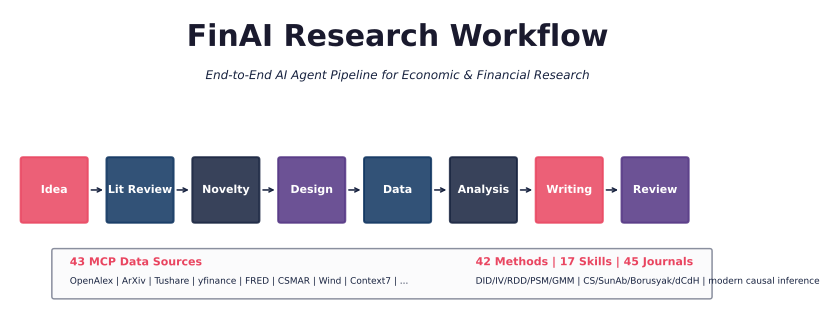
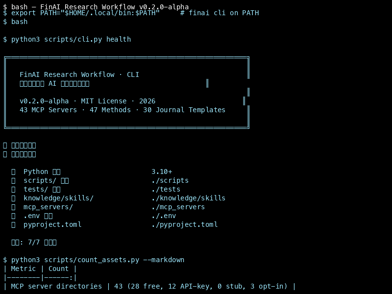
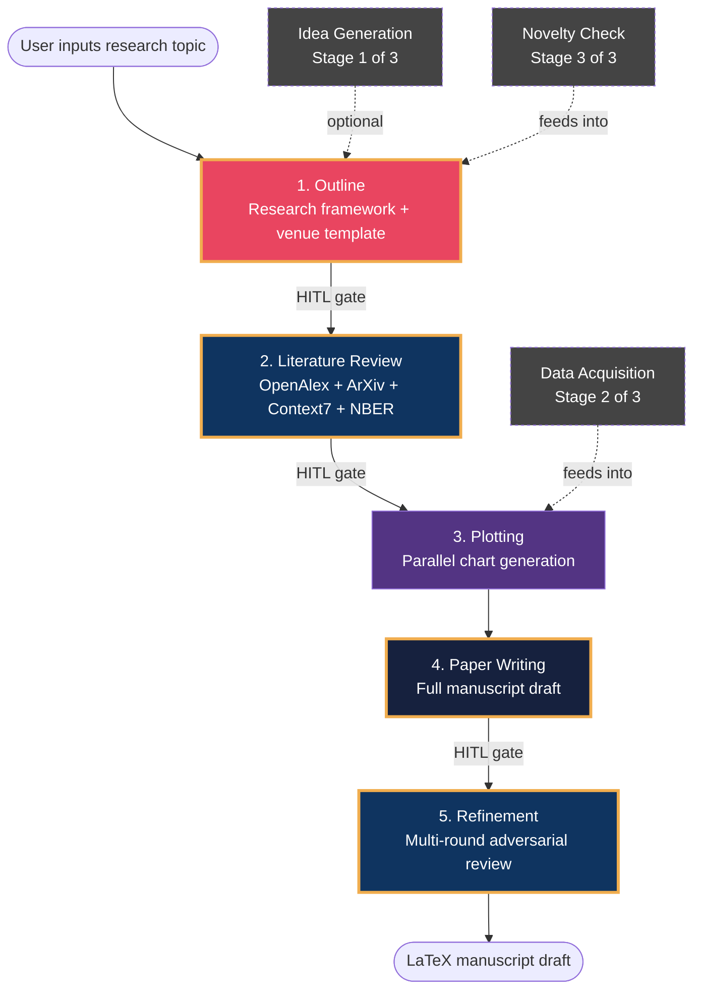
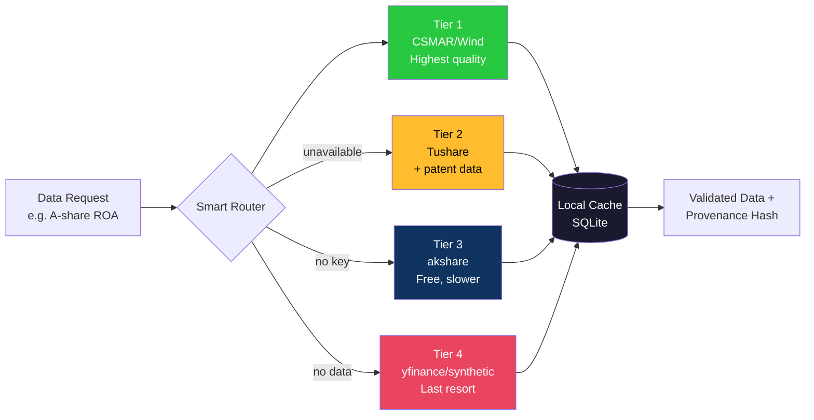
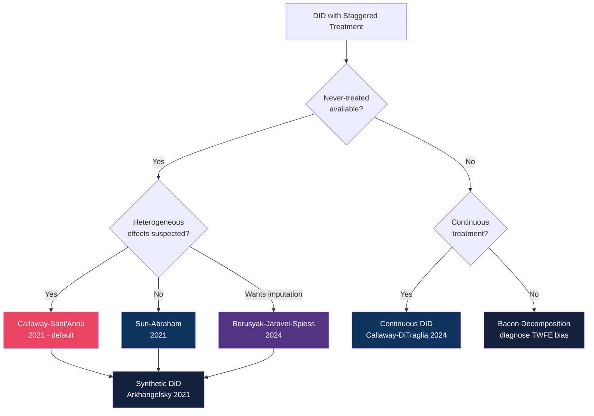

# 论文-研报工作流 · FinAI Research Workflow

> **研究主题一句话 → 收到可投稿的 LaTeX 草稿。**
> **Describe your research topic → receive a submission-ready LaTeX draft.**



[](https://github.com/csmar432/finai-research)
[](https://opensource.org/licenses/MIT)
[](https://github.com/csmar432/finai-research/releases)
[](https://arxiv.org/)
[](https://github.com/csmar432/finai-research/actions)
[](https://codecov.io/gh/csmar432/finai-research)
[](https://doi.org/10.5281/zenodo.21262689)
[](https://github.com/csmar432/finai-research/discussions)
[](https://codespaces.new/csmar432/finai-research)
[](https://star-history.com/#csmar432/finai-research&Timeline)

---

## Quick Start (30 秒上手)

```bash
# 1. 安装 (Option A 从 PyPI 装，可选；Option B 从源码装，推荐给贡献者)
#    pip install 'finai-research-workflow[extras]'
git clone https://github.com/csmar432/finai-research.git && cd finai-research
pip install -e ".[extras]"

# 2. 配置 LLM（DeepSeek 直连，免费）
export DEEPSEEK_API_KEY=sk-xxxx

# 3. 开始研究
python scripts/agent_pipeline.py --topic "Carbon trading and green innovation"
```

> **PyPI:** [finai-research-workflow · 0.2.0a0](https://pypi.org/project/finai-research-workflow/) · MIT
> **DOI:** [10.5281/zenodo.21262689](https://doi.org/10.5281/zenodo.21262689)

### Quick Demo



The demo shows an end-to-end run on a sample topic (carbon emissions
trading and green innovation): tool inventory, OpenAlex literature
search, empirical specification, real data acquisition from five
public MCP endpoints (yfinance, SEC EDGAR, World Bank, OpenAlex,
FRED), a DID coefficient table, LaTeX paper compile, and the
audit_guard report. All numerical output is fetched live at demo
generation time. See [`.github/demo/README.md`](.github/demo/README.md)
for the full inventory and regeneration commands.

**一次输入 → 8 阶段流水线：想法生成 → 文献综述 → 新颖性验证 → 实证设计 → 数据获取 → 分析 → 论文写作 → 对抗性 Review。每阶段需研究者确认。**

---

## 3 个核心能力

| | |
|---|---|
| **43 个 MCP 数据源** | A 股财务 / 美股 / 宏观（FRED/IMF/世界银行） / 学术论文（OpenAlex/ArXiv），28 个无需 API Key |
| **47 种计量方法** | 标准 DID / 交错 DID（CS/SunAb/Borusyak） / IV / RDD / 合成控制 / 面板 GMM，JF/JFE 级别稳健性检验 |
| **30 种期刊模板** | JF / JFE / RFS / 经济研究 / 金融研究 / 管理世界，中英日德四国语言 |

> ⚠️ AI 生成的因果识别策略、统计结果和引用必须由研究者独立核实后方可投稿。
> ⚠️ 5 个模拟数据服务器默认禁用，启用时输出带有 ⚠️ MOCK DATA 标识。

---

**完整文档**: [使用指南.md](使用指南.md) · [CLAUDE.md](CLAUDE.md) · [交互式配置向导](python scripts/setup_wizard.py --guided)

---


## Why FinAI Research Workflow?

- **Built for economists, not generic AI demos** — every default is calibrated for the *Journal of Finance* / *经济研究* standard (DID with heterogeneous treatment effects, cluster-robust SEs at the firm level, 19 robustness checks, parallel-trend plots).
- **43 MCP server directories** — covers A-share financials, US equities, global macro (FRED/World Bank/IMF/OECD/BEA), and 400M+ academic papers (OpenAlex). **41 directories have full Python implementations; 2 are mock-only (user-csmar, user-wind require institutional accounts); 3 are opt-in legal-risk (CNKI, Wanfang, Chinese Literature)**. Free alternatives exist via `user-financial` (akshare) and `user-yfinance`.
- **47 econometric method modules, not just OLS** — standard DID, event study, Bacon decomposition, staggered DID (Callaway-Sant'Anna/Sun-Abraham/Borusyak/Goodman-Bacon, requires `pip install diff-in-diff2`), synthetic control, instrumental variables (requires `linearmodels`), panel GMM, RDD, event studies, mediation, and more. See CLAUDE.md for the full list with dependency notes.
- **30 journal templates, English/Chinese/Japanese/German** — JF, JFE, RFS, JAE, Econometrica, 经济研究, 金融研究, 管理世界, 会计研究, 中国工业经济.
- **17 specialised AI skills** (Claude Code / Cursor / GitHub Copilot) — idea discovery, literature review, novelty check, experiment design, data acquisition, paper drafting, figure generation, LaTeX compilation, review loops.
- **Human-in-the-loop, never autonomous fabrication** — every stage requires explicit checkpoint approval; data sources are verified before use; no synthetic data without user consent.

## Why Not Just Use ChatGPT?

FinAI is purpose-built for economic & financial research. Here is what it does that general LLMs cannot:

| Capability | ChatGPT / Claude (General) | FinAI (Specialized) |
|---|---|---|
| **A-share financial data** | Manual download, error-prone | ✅ 43 MCP servers auto-fetch |
| **DID with 19 robustness checks** | Generic response | ✅ Cluster-robust SEs, Bacon decomposition, event studies |
| **JF / 经济研究 LaTeX templates** | Manual formatting | ✅ 30 journal templates, one command |
| **Causal identification strategy** | Generic suggestions | ✅ Econometrics expert knowledge embedded |
| **Literature review with provenance** | Copy-paste citations | ✅ Source tracking, citation verification |
| **Multi-stage pipeline with checkpoints** | One-off answers | ✅ 8-stage pipeline with human approval |

> [!TIP]
> Start now with zero setup: **[Open in GitHub Codespaces](https://codespaces.new/csmar432/finai-research)** (free, 120 hours/month). No install required.

> **For Chinese users:** The most comprehensive guide is **[使用指南.md](使用指南.md)** — a complete 13-chapter manual covering installation, workflows, data sources, econometric methods, paper writing, and FAQ.

---

## Who Is This For?

| Audience | Use Case |
|----------|----------|
| **PhD students / researchers** | Design empirical studies, run econometric analysis, generate LaTeX manuscripts for JF/JFE/RFS/经济研究/金融研究 |
| **Finance professors** | Automate literature reviews, track policy experiments, benchmark against published papers |
| **Graduate students** | Learn econometric methods (DID/IV/RDD) with automated validation and robustness checks |
| **Quantitative analysts** | Access A-share data, run factor analysis, generate institutional-grade research reports |
| **AI/ML researchers** | Explore LLM applications in financial research automation, provenance tracking, HITL design |

> **Not sure?** If you've ever spent days downloading data, running regressions, formatting LaTeX tables, or searching for related work — this tool is for you.

---

## MCP Server Profile: Pick What Fits You

`register_mcp_servers.py` supports 4 user-type profiles — pick the one matching your hardware and use case:

| Profile | Servers | Startup | Memory | Best For |
|---------|---------|---------|--------|----------|
| `minimal`  | 5  | ~1s  | ~30 MB  | 演示/教学 (Demo / Teaching) — low-end laptops |
| `academic` | 18 | ~4s  | ~100 MB | 学生/个人研究者 (Student / Individual) — no institution account |
| `quant`    | 30 | ~8s  | ~180 MB | 机构/量化 (Quant / Institution) — has Tushare/Wind/CSMAR |
| `full`     | 43 | ~12s | ~220 MB | 重度用户 (Power User) — all data sources, RAM ≥ 16 GB |

```bash
# 1) Dry-run first (推荐先看)
python scripts/register_mcp_servers.py --profile academic --prune --dry-run

# 2) Actually apply
python scripts/register_mcp_servers.py --profile academic --prune

# 3) List current registration
python scripts/register_mcp_servers.py --list
```

See [config/mcp_profiles.json](config/mcp_profiles.json) for full server lists and the [使用指南.md](使用指南.md#2-安装配置) chapter on installation for step-by-step.

> **Default behavior**: without `--profile`, all 43 MCP servers are registered (matches `full` profile). Use `--prune` to remove out-of-profile servers.

---

## Cross-Platform Installation

The project supports **macOS**, **Linux**, and **Windows** with platform-specific entry points:

| OS | Entry Script | Prerequisites |
|----|-------------|---------------|
| **macOS** (12+) | `./run.sh` | Python 3.10+ (Homebrew recommended) |
| **Linux** (Ubuntu 20.04+, Debian 11+, Fedora 35+) | `./run.sh` | `sudo apt install python3.10 python3-venv` (or distro equivalent) |
| **Windows** (10/11) | `run.bat` | Python 3.10+ ([python.org](https://www.python.org/downloads/)) — **check "Add to PATH"** in installer |

### Choose Your Path

This project supports two entry points — pick the one that matches your workflow:

#### Path A: AI Agent (Recommended)

The AI agent handles the full pipeline end-to-end. No need to remember commands.

```bash
# 1) Install once
./run.sh                    # macOS / Linux
run.bat                     # Windows

# 2) Health check
python scripts/health_check.py

# 3) Start an AI Agent (Claude Code / Cursor / Codex) and describe your research:
# "帮我研究关税政策对A股出口型企业创新的影响，设计一篇发表在经济研究的实证论文"
```

The AI agent automatically calls all 8 pipeline stages, MCP data sources, and LaTeX generators. Each stage requires your checkpoint approval before proceeding.

#### Path B: CLI (Script-Level Control)

Run individual scripts directly for fine-grained control:

```bash
# Full research pipeline
python scripts/agent_pipeline.py --topic "Carbon trading and green innovation"

# Research execution layer (DID/IV/RDD + writing)
python scripts/research_framework/pipeline.py --topic "Carbon trading and green innovation"

# Demo: institutional-grade financial report
python scripts/demo_research_report.py --stock 000001.SZ

# MCP tool discovery
python scripts/core/mcp_tool_market.py --search "gdp" --report

# Journal template generation
python scripts/journal_template.py --list
python scripts/journal_template.py --generate JFE output/paper.tex
```

### Platform-Specific Notes

- **macOS**: Keychain is native; keyring uses `KeychainBackend` automatically
- **Linux**: Keyring uses SecretService (gnome-keyring). For Chinese fonts, install `fonts-noto-cjk`:
  ```bash
  sudo apt install fonts-noto-cjk fonts-wqy-zenhei
  ```
- **Windows**: Keyring uses Credential Manager. Chinese fonts (`SimHei`, `Microsoft YaHei`) come pre-installed

### What Works Cross-Platform

- ✅ All `scripts/*.py` entry points
- ✅ 43 MCP servers (pure Python stdlib)
- ✅ Checkpoint (`fcntl.flock` falls back to no-op on Windows)
- ✅ 2,234 unit tests (pytest --collect-only; CI matrix: Ubuntu + macOS; no Windows)

### Known Cross-Platform Limitations

- ⚠️ `event_monitor.py` uses `signal.pause()` which is Unix-only; on Windows it falls back to a polling loop
- ⚠️ `keychain_setup.py` is macOS-specific; for Windows/Linux, use the cross-platform keyring via `scripts/keychain_manager.py`
- ⚠️ `core/sandbox.py` uses `os.fork` (Unix-only); falls back to `subprocess` on Windows
- ✅ Skills sync: `knowledge/skills/`, `.claude/skills/`, and `.github/skills/` are kept in sync via `python scripts/sync_skills.py` (no symlinks, Windows-safe). Run after editing any skill doc.

---

## Show Me What It Does

Describe your research in plain Chinese — the agent handles the rest:

```
帮我研究关税政策对A股出口型企业创新的影响，设计一篇发表在经济研究的实证论文
```

**What the agent produces automatically:**

| Stage | Output |
|-------|--------|
| Research Design | DID/IV/RDD identification strategy + data sourcing plan |
| Empirical Analysis | 47 econometric methods, automated robustness tests (19 types) |
| Paper Draft | LaTeX manuscript in journal format (JF/JFE/RFS/经济研究/金融研究/管理世界) |
| Review Loop | AI-assisted adversarial review with researcher verification required |

> **Footnote on numbers:** The table above describes the core pipeline output stages. Idea generation, novelty verification, and literature review are separate stages that run before or in parallel. MCP server counts include 43 registered servers; some require institutional/paid accounts (Tushare Pro, Wind, CSMAR, CEIC) while others work without API keys (yfinance, akshare, World Bank, IMF, OECD, FRED, ArXiv, NBER, OpenAlex). See dependency notes in CLAUDE.md.

**Architecture overview:**


*Multi-agent pipeline: User Input → AI Agent → 5-Stage Research Pipeline (outline → literature → plotting → writing → refinement, with optional HITL gates at each stage) → 43 MCP Servers → 47 Econometric Methods → 20 Chart Types → LaTeX Paper*

> **Note:** Demo assets are in `.github/demo/` and `docs/assets/`. The project is actively maintained.

---

## Key Features

| Feature | Description |
|---------|-------------|
| **Multi-Agent Pipeline** | Orchestrates 5 pipeline agents (outline → literature → plotting → writing → refinement) with optional HITL gates |
| **43 MCP Data Servers** | 43 registered MCP server directories; **41 are fully implemented in Python (stdlib HTTP + databases)**; 2 are mock-only (user-csmar, user-wind require institutional accounts); 3 are opt-in legal-risk (user-cnki, user-wanfang, user-chinese-literature). Of the 41 real servers, ~28 work without API keys (yfinance, akshare, World Bank, IMF, OECD, FRED, ArXiv, NBER, OpenAlex, SEC EDGAR, eastmoney, etc.); 11 require API keys (Tushare Pro, CEIC, EODHD, etc.). Run `python scripts/count_assets.py` for the latest breakdown. |
| **47 Econometric Methods** | DID (5 variants), RDD, synthetic control, panel GMM, spatial regression, IV/2SLS, causal ML, GARCH, survival analysis, panel cointegration — JF/JFE/RFS standard. Modern staggered DID (Callaway-Sant'Anna, Borusyak, Sun-Abraham) requires `pip install diff-in-diff2` |
| **Provenance Tracking** | Full data lineage from raw API to final chart/table |
| **HITL Gates** | Human-in-the-loop approval at critical pipeline stages |
| **Analyst Agents** | Financial analysis agents for fundamental, valuation, risk, earnings, competitive, and macro research |
| **Self-Evolution** | Continuous improvement based on task outcomes |
| **45 Journal Templates** | JF, JFE, RFS, JAE, Econometrica + 经济研究/金融研究/管理世界/会计研究/中国工业经济 etc. |

---

## Quick Start

### 5-Minute Setup

```bash
# 1. Clone the repository
git clone https://github.com/csmar432/finai-research.git
cd finai-research-workflow

# 2. Install dependencies
python3 -m venv .venv && source .venv/bin/activate
pip install -e .

# Optional: install econometrics extras (includes diff-in-diff2 for CS/BJS/Gardner DiD)
pip install -e ".[econometrics]"

# 3. Configure API key (at least one required)
cp .env.example .env
# Edit .env and add: DEEPSEEK_API_KEY=sk-your-key
# Other supported: ANTHROPIC_API_KEY, OPENAI_API_KEY

# 4. Run your first research pipeline
python scripts/research_framework/pipeline.py --topic "碳排放权交易对企业绿色创新的影响"

# Or use an AI Agent (recommended) for the full interactive workflow
```

### Via Cursor (Recommended)

Simply describe your research goal in natural language:

```
帮我分析碳排放权交易对企业绿色创新的影响，设计一篇实证论文，发表在经济研究
```

AI Agent will automatically call all necessary modules.

---

## Architecture

The system uses a **layered agent architecture** with an AI Agent (Claude Code / Cursor / Codex) as the orchestrator:


**Key numbers** (auto-generated by `scripts/count_assets.py`):

| Metric | Count |
|--------|------:|
| MCP server directories | 43 (28 free, 12 API-key, 0 stub, 3 opt-in) |
| Econometric method modules | 47 |
| Journal templates | 30 |
| AI Skills | 17 |
| Research directions | 12 |
| Test files / test functions | 98 / 296 |
| research_framework modules with tests | 21/47 |

> Run `python scripts/count_assets.py` to regenerate these numbers. They are checked into README as a snapshot of the latest count; CI is the source of truth.

---

## MCP Tools Overview

> 43 servers total: 28 work without API keys, 12 require API keys, 3 are opt-in legal-risk. See [MCP Tool Marketplace](docs/tutorials/04-mcp-marketplace.md) for the complete catalog.
>
> | Badge | Meaning |
> |-------|---------|
> | 💰 Paid | Requires institutional/paid account (Tushare Pro / Wind / CSMAR / CEIC) |
> | ⚠️ Limited | Free tier available but rate-limited or requires registration |
> | ✅ Free | No account required — works out of the box |

| MCP Server | Function | Cost | Free Tier |
|-----------|----------|------|---------|
| **user-tushare** | A-share data (quotes, financials, margin) | 💰 Paid | akshare alternative |
| **user-yfinance** | US stock, ETF, options, financials | ✅ Free | Full |
| **user-sec-edgar** | SEC 10-K/10-Q/8-K filings | ✅ Free | Full |
| **user-financial** | China macro (GDP/CPI/M2) | ✅ Free | Full |
| **user-eodhd** | US yield curve, economic calendar | ⚠️ Limited | Registration required |
| **user-fed-data** | Federal Reserve, FOMC, Beige Book | ✅ Free | Full |
| **user-wb-data** | World Bank Data API | ✅ Free | Full |
| **user-imf-data** | IMF World Economic Outlook | ✅ Free | Full |
| **user-oecd-data** | OECD Economic Data | ✅ Free | Full |
| **user-bea-data** | Bureau of Economic Analysis (US GDP) | ✅ Free | Full |
| **user-eastmoney-reports** | Research reports, news, analyst rankings | ✅ Free | Full |
| **user-enhanced-finance** | Forex, shipping indices, commodities | ✅ Free | Full |
| **user-openalex** | 400M+ academic papers + citation graph | ✅ Free | Full |
| **user-arxiv** | Academic paper search and download | ✅ Free | Full |
| **user-context7** | Full-text retrieval for papers (ArXiv/DOI) | ✅ Free | Full |
| **user-semantic-scholar** | AI-enhanced paper search | ⚠️ Limited | Optional API key |
| **user-nber-wp** | NBER Working Papers | ✅ Free | Full |
| **user-brave-search** | Web search (Chinese/English) | ⚠️ Limited | Registration required |
| **user-chinese-literature** | CSSCI, CNKI-style search | ⚠️ Limited | See legal notice in SECURITY.md |

> **A-share users without institutional accounts**: `user-yfinance` (US/ADR) and `user-financial` (akshare free tier) cover basic equity/macro needs. Paid A-share data (CSMAR/Wind/Tushare Pro) requires institutional accounts.

See [MCP Tool Marketplace Tutorial](docs/tutorials/04-mcp-marketplace.md) for the complete catalog.


---

## Available Skills (17)

Each skill is documented in `.claude/skills/` (Claude Code) and `.github/skills/` (GitHub Copilot). In Cursor, use the `Skill:` command directly.

| Skill | Description | Key Modules |
|-------|-------------|------------|
| `fin-full-pipeline` | End-to-end: topic → paper PDF | `scripts/agent_pipeline.py` |
| `fin-idea-discovery` | Idea generation + data validation | `scripts/research_framework/pipeline.py` |
| `fin-lit-review` | Systematic literature review | `scripts/citation_graph.py`, MCP multi-source |
| `fin-generate-idea` | 8-12 ranked ideas with实证验证 | MCP data validation |
| `fin-novelty-check` | Novelty validation against JF/JFE/RFS | NBER, Chinese journals search |
| `fin-experiment-design` | Complete empirical design | `modern_did.py`, `regression_engine.py` |
| `fin-paper-writing` | Writing orchestration | `report_generator.py` |
| `fin-paper-draft` | Body text generation (LaTeX) | `journal_template.py` |
| `fin-paper-plan` | Outline generation | 30 journal templates |
| `fin-paper-figure` | Chart generation (≥300 DPI) | `fin_charts.py`, `chart_factory.py` |
| `fin-paper-convert` | LaTeX compilation | `xelatex`/`pdflatex` + journal templates |
| `fin-review-loop` | Multi-round adversarial review | 5-dimension scoring |
| `fin-submit-check` | Pre-submission checklist | Format, DPI, citations audit |
| `fin-data-acquisition` | Data fetch + regression scripts | 43 MCP servers |
| `fin-brief-generator` | Auto-generate `FIN_BRIEF.md` | 5 enhanced tools |
| `fin-ref-paper` | BibTeX reference management | CrossRef DOI API |
| `fin-viz-launch` | Natural language → academic charts | `chart_pipeline.py`, 20+ types |

---

## Tutorials

| Tutorial | Description | Time |
|----------|-------------|------|
| [01 - Quick Start](docs/tutorials/01-quickstart.md) | Setup and run your first pipeline | 5 min |
| [02 - Financial Reports](docs/tutorials/02-financial-report.md) | Generate institutional research reports | 10 min |
| [03 - Research Directions](docs/tutorials/03-research-directions.md) | Design empirical studies with DID/RDD/IV | 15 min |
| [04 - MCP Marketplace](docs/tutorials/04-mcp-marketplace.md) | Discover and add MCP tools | 15 min |
| [05 - Event-Driven Research](docs/tutorials/05-event-driven-research.md) | Automate research via event monitoring | 20 min |

---

## Documentation

| Document | Description |
|----------|-------------|
| [SETUP_GUIDE.md](SETUP_GUIDE.md) | Environment setup, API keys, Docker |
| [USAGE_GUIDE.md](USAGE_GUIDE.md) | Complete usage guide (Chinese) |
| [QUICKSTART.md](QUICKSTART.md) | 5-minute quick start |
| [CLAUDE.md](CLAUDE.md) | Agent configuration and capabilities |
| [CONTRIBUTING.md](CONTRIBUTING.md) | Contribution guidelines |
| [docs/tutorials/](docs/tutorials/) | Step-by-step tutorials |
| [docs/api_reference.md](docs/api_reference.md) | API documentation |
| [docs/MOCK_DATA_POLICY.md](docs/MOCK_DATA_POLICY.md) | Mock data policy (5 servers disabled by default) |
| [docs/DOCKER_INSTALL.md](docs/DOCKER_INSTALL.md) | Docker installation guide |
| [docs/CITATION_GUIDE.md](docs/CITATION_GUIDE.md) | Citation guidance for derived work |
| [docs/GITHUB_DISCUSSIONS_SETUP.md](docs/GITHUB_DISCUSSIONS_SETUP.md) | GitHub Discussions enablement |
| [docs/ARCHITECTURE.md](docs/ARCHITECTURE.md) | System architecture overview |

---

## Common Commands

```bash
# Paper pipeline
python scripts/research_framework/pipeline.py --topic "碳排放权交易对企业绿色创新的影响"

# Financial report
python scripts/demo_research_report.py --stock 000001.SZ

# MCP tool marketplace
python scripts/core/mcp_tool_market.py --search "gdp" --report

# Event monitor
python scripts/event_monitor.py --interval 300 --test

# Literature review
python scripts/research_framework/pipeline.py --mode lit-review --topic "carbon trading innovation"

# Or use an AI Agent directly
# "帮我做碳交易创新领域的文献综述"

# Journal template
python scripts/journal_template.py --list
python scripts/journal_template.py --generate JFE output/paper.tex

# Dashboard
streamlit run scripts/dashboard.py --server.port 8050
```

---

## Data Coverage

| Market | Source | Data Types |
|--------|--------|------------|
| **A-shares** | `user-tushare` (free) | Daily quotes, financials, margin, north flow |
| **US Stocks** | yfinance + Finviz (free) | Quotes, financials, ESG, options, SEC filings |
| **Macro (Global)** | World Bank + IMF + OECD (free) | GDP, CPI, population, trade, debt |
| **Macro (China)** | `user-financial` + NBS (free) | CPI, PPI, PMI, M2, FDI, retail sales |
| **Macro (US)** | FRED + BEA + Fed (free) | NIPA, FOMC, Beige Book, yield curve |
| **Fixed Income** | EODHD (key) / `user-financial` (free) | Treasury yields, bond prices, credit spreads |
| **Forex & Commodities** | `user-enhanced-finance` + `user-financial` (free) | FX rates, shipping indices, precious metals |
| **Research Reports** | 东方财富 (free) | Analyst reports, news, sector analysis |
| **Academic** | arXiv + NBER (free) | Working papers, citations |

---

## Extending the System

### Adding a New MCP Server

1. Create directory: `mcp_servers/user_your_server/`
2. Add `SERVER_METADATA.json`
3. Add tool definitions in `tools/*.json`
4. Register in Cursor MCP settings
5. Rebuild registry: `python scripts/core/mcp_tool_market.py --dir mcp_servers`

See [MCP Marketplace Tutorial](docs/tutorials/04-mcp-marketplace.md) for full guide.

### Adding a New Research Direction

1. Create file: `scripts/research_directions/carbon_economics.py` (copy from an existing direction like `green_finance.py` as template)
2. Define `ResearchDirection` class with:
   - Research questions
   - Data requirements
   - Hypothesis derivation
   - Empirical strategy
3. Add to `scripts/research_directions/__init__.py`

---

## Contributing

Contributions welcome! Please:

1. Fork the repository
2. Create a feature branch (`git checkout -b feature/amazing-feature`)
3. Commit changes (`git commit -m 'Add amazing feature'`)
4. Push to branch (`git push origin feature/amazing-feature`)
5. Open a Pull Request

See [CONTRIBUTING.md](CONTRIBUTING.md) for full guidelines.

---

## License

This project is licensed under the MIT License. See [LICENSE](LICENSE) for details.

---

## Acknowledgments

- 5 轮交互式澄清模式参考 [Night Owl Research Agent](https://github.com/GRIND-Lab-Core/night_owl_research_agent) 设计（2026-06-27 命名已重命名）
- Inspired by [PaperOrchestra](https://github.com/google-research/paper-orchestra) multi-agent architecture
- Data powered by akshare, yfinance, World Bank API, and Tushare Pro

---

## Star History

[](https://star-history.com/#csmar432/finai-research&Timeline)

---

## Built With

| Layer | Technology |
|-------|------------|
| **AI Orchestration** | Claude Code / Cursor / Codex, Claude API, OpenAI API, Anthropic API |
| **Data (43 servers)** | `user-tushare`, `user-yfinance`, `user-financial`, `user-sec-edgar`, `user-eastmoney-*`, World Bank API, IMF API |
| **Econometrics** | statsmodels, linearmodels, scipy |
| **Visualization** | matplotlib, seaborn, plotly |
| **Pipeline** | Python 3.10+ |
| **Testing** | pytest, ruff |
| **Documentation** | MkDocs Material |
| **Containerization** | Docker, Docker Compose |

---

## Architecture Diagrams

### Pipeline DAG (8 Stages + 4 Human-in-the-Loop Checkpoints)



> **Pipeline stages note:** The core pipeline has **5 stages** (outline → literature → plotting → writing → refinement) with optional HITL gates. Idea generation, novelty verification, and data acquisition run as parallel/prior stages. The research framework CLI (`scripts/research_framework/pipeline.py`) provides a focused DID/IV/RDD analysis mode.

### MCP Data Source Selection (43 Directories: 41 Real + 2 Mock + 3 Opt-in Legal)



### Modern DID Estimator Selection



---

## How FinAI Fits in the Ecosystem

FinAI focuses on the **end-to-end workflow of empirical economic and finance research**:
research idea → literature review → empirical design → data acquisition → analysis → paper draft → submission.

General causal-inference libraries (e.g. [`dowhy`](https://github.com/py-why/dowhy),
[`StatsPAI`](https://github.com/brycewang-stanford/StatsPAI),
[`diff-diff`](https://github.com/igerber/diff-diff)) focus on the CI *algorithm* layer.
FinAI focuses on the *research workflow* layer that wraps data, econometrics, journal
templates, and human-in-the-loop gates into one pipeline.

This focus brings complementary features for economists:

- **43 MCP data sources** for A-share financials (Tushare/CSMAR/Wind), US equities (yfinance),
  global macro (FRED/World Bank/IMF/OECD/BEA), and 400M+ academic papers (OpenAlex/ArXiv).
- **47 econometric method modules** including modern staggered DID
  (Callaway-Sant'Anna, Sun-Abraham, Borusyak), synthetic control/DiD, IV/2SLS,
  panel GMM, RDD, triple-diff, panel quantile, spatial regression, etc.
- **30 journal templates** (EN+ZH+JP+DE) covering *JF / JFE / RFS / JPE / Econometrica /
  经济研究 / 金融研究 / 管理世界 / 会计研究 / ZWiSt / JNS* and more.
- **Human-in-the-loop gates** at every pipeline stage to prevent LLM hallucinations.

See [Related Projects](#related-projects) below for tools that work alongside FinAI.

---

## Maintainer

This project is maintained by **[@csmar432](https://github.com/csmar432)**.

- 🐛 **Bug reports & feature requests**: [GitHub Issues](https://github.com/csmar432/finai-research/issues)
- 💬 **Questions & ideas**: [GitHub Discussions](https://github.com/csmar432/finai-research/discussions)
- 🔒 **Security disclosures**: [GitHub Security Advisories](https://github.com/csmar432/finai-research/security/advisories/new)
- 💖 **Sponsor / support**: [GitHub Sponsors](https://github.com/sponsors/csmar432) · [爱发电](https://afdian.net/a/finresearch)

> Contributions of all sizes are welcome — see [CONTRIBUTING.md](CONTRIBUTING.md) for the workflow.

## Cite This Work

If this project helps your research, **give it a ⭐** — it tells other economists the project is worth their time.

If you use FinAI Research Workflow in published research, please cite it as:

```bibtex
@software{finai2026,
  title  = {FinAI Research Workflow: An End-to-End AI Agent Pipeline for Economic and Financial Research},
  author = {csmar432},
  year   = {2026},
  month  = jun,
  url    = {https://github.com/csmar432/finai-research},
  note   = {GitHub repository. For a permanent DOI, publish on Zenodo and update this field.}
}
```

## Related Projects

- [**dowhy**](https://github.com/py-why/dowhy) — causal inference library (8.2K ⭐)
- [**StatsPAI**](https://github.com/brycewang-stanford/StatsPAI) — agent-native causal inference toolkit (274 ⭐)
- [**moderndid**](https://github.com/jordandeklerk/moderndid) — GPU-accelerated modern DiD (25 ⭐)
- [**diff-diff**](https://github.com/igerber/diff-diff) — sklearn-like DiD in Python (280 ⭐)
- [**PaperOrchestra**](https://github.com/google-research/paper-orchestra) — Google's multi-agent paper writing (82 ⭐)
- [**E2ER-project**](https://github.com/bhanneke/E2ER-project) — end-to-end empirical research pipeline (1 ⭐)
- [**econ-paper-studio**](https://github.com/gaaiyun/econ-paper-studio) — agent-native CLI for empirical economics (2 ⭐)


MIT License — see [LICENSE](LICENSE) for the full text.

