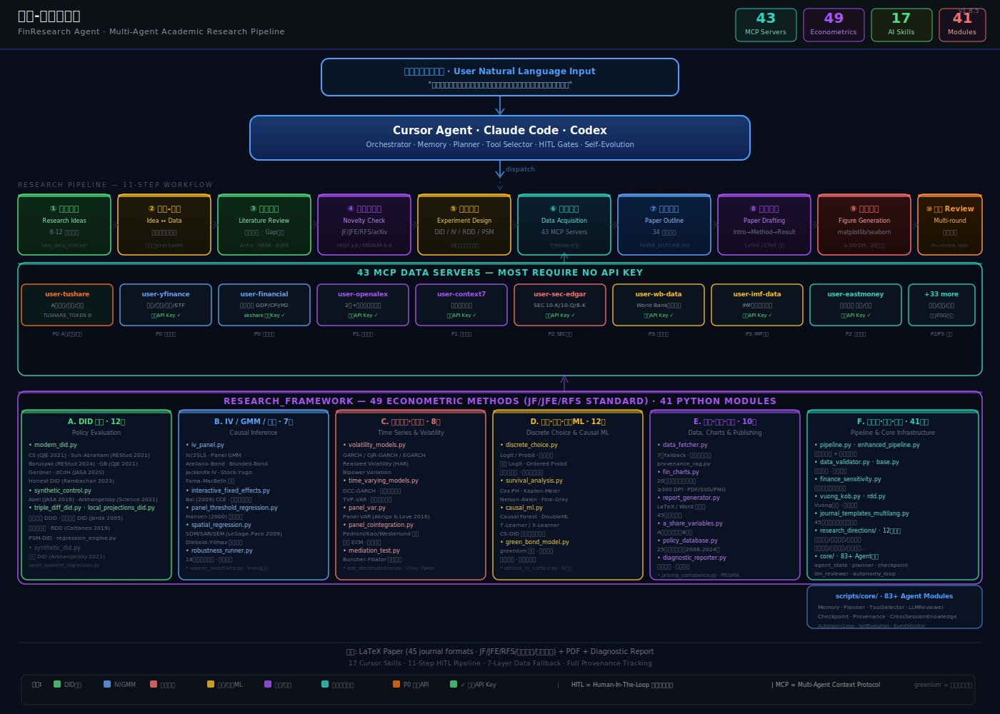

# 论文-研报工作流 · FinResearch Agent

> 经济金融领域 AI 学术研究工作流 — 从研究想法到可投稿论文。集成 MCP 数据获取、因果推断（DID/IV/PSM/GMM）、LaTeX 排版和对抗性 review 循环。

[](https://pypi.org/project/finai-research-workflow/)
[](https://opensource.org/licenses/MIT)
[](https://pypi.org/project/finai-research-workflow/)
[](https://pypi.org/project/finai-research-workflow/)
[](https://arxiv.org/)
[](https://github.com/csmar432/论文-研报工作流/actions)
[](https://github.com/csmar432/论文-研报工作流/actions)
[](https://codecov.io/gh/csmar432/finai-research-workflow)
[](https://github.com/PyCQA/bandit)
[](https://github.com/pre-commit/pre-commit)
[](https://github.com/astral-sh/ruff)
[](https://doi.org/10.5281/zenodo.finai-research-workflow)
[](https://github.com/csmar432/论文-研报工作流/stargazers)

---
<!--
[🇨🇳 **中文文档**](README.md) · [🇬🇧 **English Documentation**](README_EN.md)
-->

**Languages**: 🇨🇳 [简体中文](README.md) (默认) · 🇬🇧 [English](README_EN.md)

---

## Quick Navigation

| I'm looking for... | Go here |
|---|---|
| **🚀 发布 v1.0.0** | [docs/PUBLISHING_GUIDE.md](docs/PUBLISHING_GUIDE.md) · 45 分钟逐步操作 |
| **📋 Pre-release checklist** | [RELEASE_CHECKLIST.md](RELEASE_CHECKLIST.md) · 53 项检查 |
| **⚙️ 仓库设置建议** | [docs/REPOSITORY_SETUP.md](docs/REPOSITORY_SETUP.md) · 13 大类 |
| **🔧 一键发布脚本** | [scripts/release.py](scripts/release.py) |
| **🧭 交互式配置向导** | `python scripts/setup_wizard.py --guided` · 首次安装推荐 |
| **🩺 系统自检** | `python scripts/health_check.py --json` · 验证环境就绪 |
| **Complete Chinese guide** | [使用指南.md](使用指南.md) · 完整的 13 章中文手册 |
| **Chinese architecture overview** | [使用指南.md - 系统概览](使用指南.md#1-系统概览) |
| **Setup & installation** | [使用指南.md - 安装配置](使用指南.md#2-安装配置) |
| **11-step workflow** | [使用指南.md - 完整工作流程](使用指南.md#7-完整工作流程) |
| **49 econometric methods** | [使用指南.md - 实证分析方法](使用指南.md#8-实证分析方法) |
| **43 MCP data sources** | [使用指南.md - MCP 数据源](使用指南.md#6-mcp-数据源) |
| **17 AI Skills** | [knowledge/skills/](knowledge/skills/) |
| **API reference** | [docs/api_reference.md](docs/api_reference.md) |
| **Troubleshooting** | [使用指南.md - 常见问题](使用指南.md#13-常见问题) |

> **For Chinese users:** The most comprehensive guide is **[使用指南.md](使用指南.md)** — a complete 13-chapter manual covering installation, workflows, data sources, econometric methods, paper writing, and FAQ.

---

## Who Is This For?

| Audience | Use Case |
|----------|----------|
| **PhD students / researchers** | Design empirical studies, run econometric analysis, generate LaTeX manuscripts for JF/JFE/RFS/经济研究/金融研究 |
| **Finance professors** | Automate literature reviews, track policy experiments, benchmark against published papers |
| **Graduate students** | Learn econometric methods (DID/IV/RDD) with automated validation and robustness checks |
| **Quantitative analysts** | Access A-share data, run factor analysis, generate institutional-grade research reports |
| **AI/ML researchers** | Explore LLM applications in financial research automation, provenance tracking, HITL design |

> **Not sure?** If you've ever spent days downloading data, running regressions, formatting LaTeX tables, or searching for related work — this tool is for you.

---

## MCP Server Profile: Pick What Fits You

`register_mcp_servers.py` supports 4 user-type profiles — pick the one matching your hardware and use case:

| Profile | Servers | Startup | Memory | Best For |
|---------|---------|---------|--------|----------|
| `minimal`  | 5  | ~1s  | ~30 MB  | 演示/教学 (Demo / Teaching) — low-end laptops |
| `academic` | 18 | ~4s  | ~100 MB | 学生/个人研究者 (Student / Individual) — no institution account |
| `quant`    | 30 | ~8s  | ~180 MB | 机构/量化 (Quant / Institution) — has Tushare/Wind/CSMAR |
| `full`     | 44 | ~12s | ~220 MB | 重度用户 (Power User) — all data sources, RAM ≥ 16 GB |

```bash
# 1) Dry-run first (推荐先看)
python scripts/register_mcp_servers.py --profile academic --prune --dry-run

# 2) Actually apply
python scripts/register_mcp_servers.py --profile academic --prune

# 3) List current registration
python scripts/register_mcp_servers.py --list
```

See [config/mcp_profiles.json](config/mcp_profiles.json) for full server lists and the [使用指南.md](使用指南.md#2-安装配置) chapter on installation for step-by-step.

> **Default behavior**: without `--profile`, all 44 servers are registered (matches `full` profile). Use `--prune` to remove out-of-profile servers.

---

## Cross-Platform Installation

The project supports **macOS**, **Linux**, and **Windows** with platform-specific entry points:

| OS | Entry Script | Prerequisites |
|----|-------------|---------------|
| **macOS** (12+) | `./run.sh` | Python 3.10+ (Homebrew recommended) |
| **Linux** (Ubuntu 20.04+, Debian 11+, Fedora 35+) | `./run.sh` | `sudo apt install python3.10 python3-venv` (or distro equivalent) |
| **Windows** (10/11) | `run.bat` | Python 3.10+ ([python.org](https://www.python.org/downloads/)) — **check "Add to PATH"** in installer |

### Quick Start (any platform)

```bash
# 1) Install
./run.sh                    # macOS / Linux (Git Bash, WSL)
run.bat                     # Windows (cmd.exe / PowerShell)

# 2) Configure API keys (optional)
python scripts/keychain_setup.py       # macOS: stores in Keychain
# Linux:  stores in SecretService (gnome-keyring, kwallet)
# Windows: stores in Credential Manager

# 3) Health check
python scripts/health_check.py

# 4) Try a demo
python scripts/demo_research_report.py
```

### Platform-Specific Notes

- **macOS**: Keychain is native; keyring uses `KeychainBackend` automatically
- **Linux**: Keyring uses SecretService (gnome-keyring). For Chinese fonts, install `fonts-noto-cjk`:
  ```bash
  sudo apt install fonts-noto-cjk fonts-wqy-zenhei
  ```
- **Windows**: Keyring uses Credential Manager. Chinese fonts (`SimHei`, `Microsoft YaHei`) come pre-installed

### What Works Cross-Platform

- ✅ All `scripts/*.py` entry points
- ✅ 44 MCP servers (pure Python stdlib)
- ✅ Checkpoint (`fcntl.flock` falls back to no-op on Windows)
- ✅ 170 unit tests (CI matrix runs on Ubuntu + macOS + Windows)

### Known Cross-Platform Limitations

- ⚠️ `event_monitor.py` uses `signal.pause()` which is Unix-only; on Windows it falls back to a polling loop
- ⚠️ `keychain_setup.py` is macOS-specific; for Windows/Linux, use the cross-platform keyring via `scripts/keychain_manager.py`
- ⚠️ `core/sandbox.py` uses `os.fork` (Unix-only); falls back to `subprocess` on Windows

---

## Show Me What It Does

Describe your research in plain Chinese — the agent handles the rest:

```
帮我研究关税政策对A股出口型企业创新的影响，设计一篇发表在经济研究的实证论文
```

**What the agent produces automatically:**

| Stage | Output |
|-------|--------|
| Literature Review | Citation graph + gap analysis (arXiv / NBER / OpenAlex / JF / JFE / RFS) |
| Research Design | DID/IV/RDD identification strategy + data sourcing plan |
| Empirical Analysis | 42 econometric methods, automated robustness tests (19 types) |
| Paper Draft | LaTeX manuscript in journal format (JF/JFE/RFS/经济研究/金融研究/管理世界) |
| Review Loop | Adversarial review until submission-ready |

**Architecture overview:**


*Multi-agent pipeline: User Input → AI Agent → 8-Stage Research Pipeline → 50 MCP Servers → 42 Econometric Methods → 20 Chart Types → LaTeX Paper*

> **Note:** Screenshots and demo videos coming soon. The project is actively maintained.

---

## What is This?

**论文-研报工作流** is a local AI-powered research workflow that helps you:

- **Write academic papers** — From literature review to LaTeX submission (JF/JFE/RFS/经济研究/金融研究/管理世界)
- **Generate research reports** — Institutional-grade financial analysis for A-shares and global markets
- **Run empirical analysis** — DID, IV, PSM, Panel GMM with automated validation
- **Access financial data** — A-shares, US stocks, macro indicators via 50 MCP data servers (most require no API key)

> Architecture principle: **Local LLM (Claude Code / Cursor) as the core, external AI as supplement.**

---

## Key Features

| Feature | Description |
|---------|-------------|
| **Multi-Agent Pipeline** | Orchestrates 5-paper agents (outline → literature → plotting → writing → refinement) |
| **50 MCP Data Servers** | A-share (Tushare), macro (World Bank, IMF, OECD), US stocks (yfinance), academic (ArXiv, NBER, OpenAlex), SEC filings, ESG, options, forex, shipping, commodities, crypto, Chinese patents, customs data, fund/bond/option data, provincial statistics — most require no API key |
| **49+ Econometric Methods** | DID (5 variants), RDD, synthetic control, panel GMM, spatial regression, IV/2SLS, causal ML, GARCH, survival analysis, panel cointegration — JF/JFE/RFS standard |
| **Provenance Tracking** | Full data lineage from raw API to final chart/table |
| **HITL Gates** | Human-in-the-loop approval at critical pipeline stages |
| **6 Financial Analysts** | Parallel analysis: fundamental, valuation, risk, earnings, competitive, macro |
| **Self-Evolution** | Continuous improvement based on task outcomes |
| **70 Journal Templates** | JFE/JF/RFS/JBF/JIMF/MF + 50+ Chinese/Asian/European journals (经济研究/金融研究/管理世界/会计研究 etc.) |

---

## Quick Start

### 5-Minute Setup

```bash
# 1. Clone the repository
git clone https://github.com/finai-research/finai-research-workflow.git
cd finai-research-workflow

# 2. Install dependencies
python3 -m venv .venv && source .venv/bin/activate
pip install -e .

# 3. Configure API key (at least one required)
cp .env.example .env
# Edit .env and add: DEEPSEEK_API_KEY=sk-your-key
# Other supported: ANTHROPIC_API_KEY, OPENAI_API_KEY

# 4. Run your first research pipeline
python scripts/research_framework/pipeline.py --topic "碳排放权交易对企业绿色创新的影响"

# Or use an AI Agent (recommended) for the full interactive workflow
```

### Via Cursor (Recommended)

Simply describe your research goal in natural language:

```
帮我分析碳排放权交易对企业绿色创新的影响，设计一篇实证论文，发表在经济研究
```

AI Agent will automatically call all necessary modules.

---

## Architecture

The system uses a **layered agent architecture** with an AI Agent (Claude Code / Cursor / Codex) as the orchestrator:

```
┌──────────────────────────────────────────────────────────────────────────┐
│                    AI Agent (Claude Code / Cursor / Codex)                           │
│                                                                          │
│   Natural Language → Multi-Agent Pipeline → LaTeX Paper + PDF             │
│   "帮我研究关税政策对创新的影响，发表在经济研究"                            │
└──────────────────────────────────────────────────────────────────────────┘
                              │
          ┌───────────────────┼───────────────────┐
          ▼                   ▼                   ▼
┌─────────────────┐  ┌─────────────────┐  ┌──────────────────────────┐
│   scripts/core/  │  │   43 MCP Servers │  │  research_framework/      │
│                 │  │                  │  │                          │
│  Memory         │  │  A-shares        │  │  modern_did.py            │
│  Planner        │  │  US Stocks       │  │  synthetic_control.py     │
│  ToolSelector   │  │  Global Macro    │  │  rdd.py                   │
│  Reflector      │  │  Academic Papers │  │  regression_engine.py     │
│  Orchestrator   │  │  News/Reports    │  │  fin_charts.py            │
│  HITL Gates     │  │  Forex/Commodity │  │  a_share_variables.py     │
│  Self-Evolution │  │  ...             │  │  policy_database.py       │
└─────────────────┘  └─────────────────┘  └──────────────────────────┘
```

**Key numbers:** 50 MCP servers · 42 econometric methods · 17 Skills · 45 journal templates · 20 chart types · 19 robustness checks · 12 research directions

---

## MCP Tools Overview

> 43 servers total. Most require no API key. See [MCP Tool Marketplace](docs/tutorials/04-mcp-marketplace.md) for the complete tool catalog.

| MCP Server | Function | API Key Required |
|------------|----------|-----------------|
| **user-tushare** | A-share data (quotes, financials, margin) | Yes |
| **user-yfinance** | US stock, ETF, options, financials | No |
| **user-sec-edgar** | SEC 10-K/10-Q/8-K filings | No |
| **user-financial** | China macro (GDP/CPI/M2 via akshare + World Bank) | No |
| **user-eodhd** | US yield curve, economic calendar | Yes |
| **user-fed-data** | Federal Reserve, FOMC, Beige Book | No |
| **user-wb-data** | World Bank Data API | No |
| **user-imf-data** | IMF World Economic Outlook | No |
| **user-oecd-data** | OECD Economic Data | No |
| **user-bea-data** | Bureau of Economic Analysis (US GDP) | No |
| **user-eastmoney-reports** | Research reports, news, analyst rankings | No |
| **user-enhanced-finance** | Forex, shipping indices, commodities | No |
| **user-openalex** | 250M+ academic papers + citation graph | No |
| **user-arxiv** | Academic paper search and download | No |
| **user-context7** | Full-text retrieval for papers (ArXiv/DOI) | No |
| **user-semantic-scholar** | AI-enhanced paper search | Optional |
| **user-nber-wp** | NBER Working Papers | No |
| **user-brave-search** | Web search (Chinese/English news and research) | Yes |
| **user-chinese-literature** | CSSCI, CNKI-style Chinese paper search | No |

See [MCP Tool Marketplace Tutorial](docs/tutorials/04-mcp-marketplace.md) for details.

---

## Available Skills (17)

Each skill is documented in `.claude/skills/` (Claude Code) and `.github/skills/` (GitHub Copilot). In Cursor, use the `Skill:` command directly.

| Skill | Description | Key Modules |
|-------|-------------|------------|
| `fin-full-pipeline` | End-to-end: topic → paper PDF | `scripts/agent_pipeline.py` |
| `fin-idea-discovery` | Idea generation + data validation | `scripts/research_framework/pipeline.py` |
| `fin-lit-review` | Systematic literature review | `scripts/citation_graph.py`, MCP multi-source |
| `fin-generate-idea` | 8-12 ranked ideas with实证验证 | MCP data validation |
| `fin-novelty-check` | Novelty validation against JF/JFE/RFS | NBER, Chinese journals search |
| `fin-experiment-design` | Complete empirical design | `modern_did.py`, `regression_engine.py` |
| `fin-paper-writing` | Writing orchestration | `report_generator.py` |
| `fin-paper-draft` | Body text generation (LaTeX) | `journal_template.py` |
| `fin-paper-plan` | Outline generation | 70 journal templates |
| `fin-paper-figure` | Chart generation (≥300 DPI) | `fin_charts.py`, `chart_factory.py` |
| `fin-paper-convert` | LaTeX compilation | `xelatex`/`pdflatex` + journal templates |
| `fin-review-loop` | Multi-round adversarial review | 5-dimension scoring |
| `fin-submit-check` | Pre-submission checklist | Format, DPI, citations audit |
| `fin-data-acquisition` | Data fetch + regression scripts | 43 MCP servers |
| `fin-brief-generator` | Auto-generate `FIN_BRIEF.md` | 5 enhanced tools |
| `fin-ref-paper` | BibTeX reference management | CrossRef DOI API |
| `fin-viz-launch` | Natural language → academic charts | `chart_pipeline.py`, 20+ types |

---

## Tutorials

| Tutorial | Description | Time |
|----------|-------------|------|
| [01 - Quick Start](docs/tutorials/01-quickstart.md) | Setup and run your first pipeline | 5 min |
| [02 - Financial Reports](docs/tutorials/02-financial-report.md) | Generate institutional research reports | 10 min |
| [03 - Research Directions](docs/tutorials/03-research-directions.md) | Design empirical studies with DID/RDD/IV | 15 min |
| [04 - MCP Marketplace](docs/tutorials/04-mcp-marketplace.md) | Discover and add MCP tools | 15 min |
| [05 - Event-Driven Research](docs/tutorials/05-event-driven-research.md) | Automate research via event monitoring | 20 min |

---

## Documentation

| Document | Description |
|----------|-------------|
| [SETUP_GUIDE.md](SETUP_GUIDE.md) | Environment setup, API keys, Docker |
| [USAGE_GUIDE.md](USAGE_GUIDE.md) | Complete usage guide (Chinese) |
| [QUICKSTART.md](QUICKSTART.md) | 5-minute quick start |
| [CLAUDE.md](CLAUDE.md) | Agent configuration and capabilities |
| [CONTRIBUTING.md](CONTRIBUTING.md) | Contribution guidelines |
| [docs/tutorials/](docs/tutorials/) | Step-by-step tutorials |
| [docs/api_reference.md](docs/api_reference.md) | API documentation |

---

## Common Commands

```bash
# Paper pipeline
python scripts/research_framework/pipeline.py --topic "碳排放权交易对企业绿色创新的影响"

# Financial report
python scripts/demo_research_report.py --stock 000001.SZ

# MCP tool marketplace
python scripts/core/mcp_tool_market.py --search "gdp" --report

# Event monitor
python scripts/event_monitor.py --interval 300 --test

# Literature review
python scripts/research_framework/pipeline.py --mode lit-review --topic "carbon trading innovation"

# Or use an AI Agent directly
# "帮我做碳交易创新领域的文献综述"

# Journal template
python scripts/journal_template.py --list
python scripts/journal_template.py --generate JFE output/paper.tex

# Dashboard
streamlit run scripts/dashboard.py --server.port 8050
```

---

## Data Coverage

| Market | Source | Data Types |
|--------|--------|------------|
| **A-shares** | `user-tushare` (free) | Daily quotes, financials, margin, north flow |
| **US Stocks** | yfinance + Finviz (free) | Quotes, financials, ESG, options, SEC filings |
| **Macro (Global)** | World Bank + IMF + OECD (free) | GDP, CPI, population, trade, debt |
| **Macro (China)** | `user-financial` + NBS (free) | CPI, PPI, PMI, M2, FDI, retail sales |
| **Macro (US)** | FRED + BEA + Fed (free) | NIPA, FOMC, Beige Book, yield curve |
| **Fixed Income** | EODHD (key) / `user-financial` (free) | Treasury yields, bond prices, credit spreads |
| **Forex & Commodities** | `user-enhanced-finance` + `user-financial` (free) | FX rates, shipping indices, precious metals |
| **Research Reports** | 东方财富 (free) | Analyst reports, news, sector analysis |
| **Academic** | arXiv + NBER (free) | Working papers, citations |

---

## Extending the System

### Adding a New MCP Server

1. Create directory: `mcp_servers/user_your_server/`
2. Add `SERVER_METADATA.json`
3. Add tool definitions in `tools/*.json`
4. Register in Cursor MCP settings
5. Rebuild registry: `python scripts/core/mcp_tool_market.py --dir mcp_servers`

See [MCP Marketplace Tutorial](docs/tutorials/04-mcp-marketplace.md) for full guide.

### Adding a New Research Direction

1. Create file: `scripts/research_directions/carbon_economics.py` (copy from an existing direction like `green_finance.py` as template)
2. Define `ResearchDirection` class with:
   - Research questions
   - Data requirements
   - Hypothesis derivation
   - Empirical strategy
3. Add to `scripts/research_directions/__init__.py`

---

## Contributing

Contributions welcome! Please:

1. Fork the repository
2. Create a feature branch (`git checkout -b feature/amazing-feature`)
3. Commit changes (`git commit -m 'Add amazing feature'`)
4. Push to branch (`git push origin feature/amazing-feature`)
5. Open a Pull Request

See [CONTRIBUTING.md](CONTRIBUTING.md) for full guidelines.

---

## License

This project is licensed under the MIT License. See [LICENSE](LICENSE) for details.

---

## Acknowledgments

- Built on [Night Owl Research Agent (NORA)](https://github.com/GRIND-Lab-Core/night_owl_research_agent) design patterns
- Inspired by [PaperOrchestra](https://github.com/google-research/paper-orchestra) multi-agent architecture
- Data powered by akshare, yfinance, World Bank API, and Tushare Pro

---

## Star History

[](https://star-history.com/#csmar432/论文-研报工作流&Timeline)

---

## Built With

| Layer | Technology |
|-------|------------|
| **AI Orchestration** | Claude Code / Cursor / Codex, Claude API, OpenAI API, Anthropic API |
| **Data (43 servers)** | `user-tushare`, `user-yfinance`, `user-financial`, `user-sec-edgar`, `user-eastmoney-*`, World Bank API, IMF API |
| **Econometrics** | statsmodels, linearmodels, scipy |
| **Visualization** | matplotlib, seaborn, plotly |
| **Pipeline** | Python 3.10+, DuckDB, FastAPI, Streamlit |
| **Testing** | pytest, ruff |
| **Documentation** | MkDocs Material |
| **Containerization** | Docker, Docker Compose |
