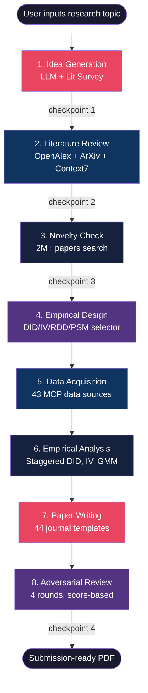
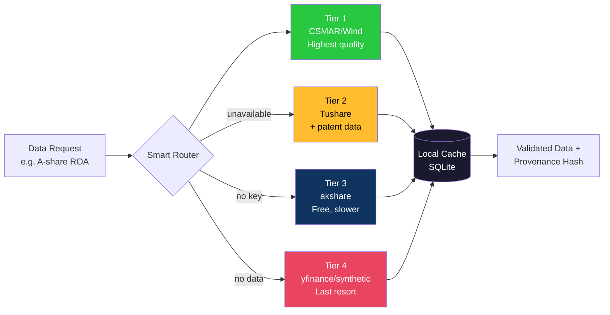
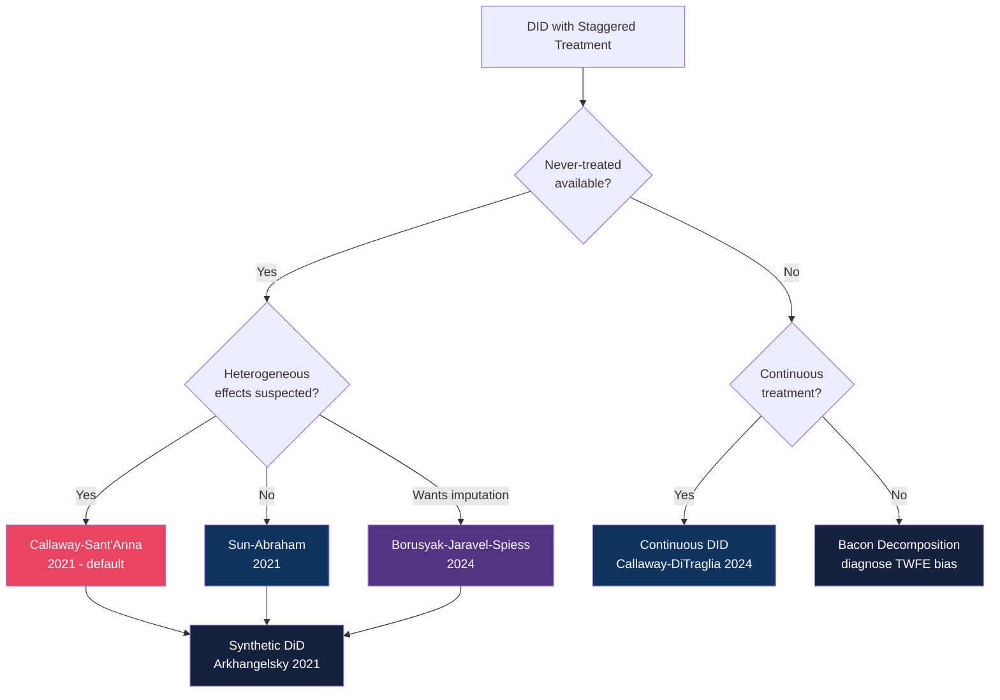

# 论文-研报工作流 · FinAI Research Workflow

> **Describe your research topic → receive a submission-ready LaTeX draft.**
>
> An end-to-end AI agent pipeline for economic and financial research — from raw idea to manuscript draft. Integrates 43 MCP data sources, modern causal inference (DID/IV/RDD/PSM/GMM), LaTeX formatting for 44 journals, and AI-assisted review loops.
>
> ⚠️ **Important**: This tool generates manuscript drafts that require human review before submission. All causal identification strategies, statistical results, and citations must be verified by a researcher.


[](https://pypi.org/project/finai-research-workflow/)
[](https://opensource.org/licenses/MIT)
[](https://pypi.org/project/finai-research-workflow/)
[](https://pypi.org/project/finai-research-workflow/)
[](https://arxiv.org/)
[](https://github.com/csmar432/finai-research-workflow/actions)
[](https://github.com/csmar432/finai-research-workflow/actions)
[](https://codecov.io/gh/csmar432/finai-research-workflow)
[](https://github.com/PyCQA/bandit)
[](https://github.com/pre-commit/pre-commit)
[](https://github.com/astral-sh/ruff)
[](https://github.com/csmar432/finai-research-workflow/stargazers)

---
<!--
[🇨🇳 **中文文档**](README.md) · [🇬🇧 **English Documentation**](README_EN.md)
-->

**Languages**: 🇨🇳 [简体中文](README.md) (默认) · 🇬🇧 [English](README_EN.md)

---

## Quick Navigation

| I'm looking for... | Go here |
|---|---|
| **🧭 交互式配置向导** | `python scripts/setup_wizard.py --guided` · 首次安装推荐 |
| **🩺 系统自检** | `python scripts/health_check.py --json` · 验证环境就绪 |
| **Complete Chinese guide** | [使用指南.md](使用指南.md) · 完整的 13 章中文手册 |
| **~30 econometric methods** | [使用指南.md - 实证分析方法](使用指南.md#8-实证分析方法) |
| **43 MCP data sources** | [使用指南.md - MCP 数据源](使用指南.md#6-mcp-数据源) |
| **17 AI Skills** | [knowledge/skills/](knowledge/skills/) |
| **API reference** | [scripts/](scripts/) 目录下的每个模块都含 docstring 和类型注解 |
| **Troubleshooting** | [使用指南.md - 常见问题](使用指南.md#13-常见问题) |

## 60-Second Demo

```bash
$ python scripts/agent_pipeline.py --topic "Carbon trading and green innovation"
```


**From a one-line research question to a structured research plan — time and API costs vary by topic complexity, data availability, and LLM model used.** All eight stages (idea generation → literature review → novelty check → empirical design → data acquisition → analysis → writing → adversarial review) include human-in-the-loop checkpoints.

## Why FinAI Research Workflow?

- **Built for economists, not generic AI demos** — every default is calibrated for the *Journal of Finance* / *经济研究* standard (DID with heterogeneous treatment effects, cluster-robust SEs at the firm level, 19 robustness checks, parallel-trend plots).
- **43 MCP data sources** — pull A-share financials, US equities, global macro (FRED/World Bank/IMF/OECD/BEA), and 200M+ academic papers directly from the agent. Note: A-share data (Tushare Pro, Wind, CSMAR) requires institutional/paid accounts; free alternatives exist via `user-financial` (akshare) and `user-yfinance`.
- **~30 econometric methods, not just OLS** — standard DID, event study, Bacon decomposition, staggered DID (Callaway-Sant'Anna/Sun-Abraham/Borusyak/Goodman-Bacon, requires `pip install diff-in-diff2`), synthetic control, instrumental variables (requires `linearmodels`), panel GMM, RDD, event studies, mediation, and more. See CLAUDE.md for the full list with dependency notes.
- **44 journal templates, both English and Chinese** — JF, JFE, RFS, JAE, Econometrica, 经济研究, 金融研究, 管理世界, 会计研究, 中国工业经济.
- **17 specialised AI skills** (Claude Code / Cursor / GitHub Copilot) — idea discovery, literature review, novelty check, experiment design, data acquisition, paper drafting, figure generation, LaTeX compilation, review loops.
- **Human-in-the-loop, never autonomous fabrication** — every stage requires explicit checkpoint approval; data sources are verified before use; no synthetic data without user consent.

> **For Chinese users:** The most comprehensive guide is **[使用指南.md](使用指南.md)** — a complete 13-chapter manual covering installation, workflows, data sources, econometric methods, paper writing, and FAQ.

---

## Who Is This For?

| Audience | Use Case |
|----------|----------|
| **PhD students / researchers** | Design empirical studies, run econometric analysis, generate LaTeX manuscripts for JF/JFE/RFS/经济研究/金融研究 |
| **Finance professors** | Automate literature reviews, track policy experiments, benchmark against published papers |
| **Graduate students** | Learn econometric methods (DID/IV/RDD) with automated validation and robustness checks |
| **Quantitative analysts** | Access A-share data, run factor analysis, generate institutional-grade research reports |
| **AI/ML researchers** | Explore LLM applications in financial research automation, provenance tracking, HITL design |

> **Not sure?** If you've ever spent days downloading data, running regressions, formatting LaTeX tables, or searching for related work — this tool is for you.

---

## MCP Server Profile: Pick What Fits You

`register_mcp_servers.py` supports 4 user-type profiles — pick the one matching your hardware and use case:

| Profile | Servers | Startup | Memory | Best For |
|---------|---------|---------|--------|----------|
| `minimal`  | 5  | ~1s  | ~30 MB  | 演示/教学 (Demo / Teaching) — low-end laptops |
| `academic` | 18 | ~4s  | ~100 MB | 学生/个人研究者 (Student / Individual) — no institution account |
| `quant`    | 30 | ~8s  | ~180 MB | 机构/量化 (Quant / Institution) — has Tushare/Wind/CSMAR |
| `full`     | 43 | ~12s | ~220 MB | 重度用户 (Power User) — all data sources, RAM ≥ 16 GB |

```bash
# 1) Dry-run first (推荐先看)
python scripts/register_mcp_servers.py --profile academic --prune --dry-run

# 2) Actually apply
python scripts/register_mcp_servers.py --profile academic --prune

# 3) List current registration
python scripts/register_mcp_servers.py --list
```

See [config/mcp_profiles.json](config/mcp_profiles.json) for full server lists and the [使用指南.md](使用指南.md#2-安装配置) chapter on installation for step-by-step.

> **Default behavior**: without `--profile`, all 43 MCP servers are registered (matches `full` profile). Use `--prune` to remove out-of-profile servers.

---

## Cross-Platform Installation

The project supports **macOS**, **Linux**, and **Windows** with platform-specific entry points:

| OS | Entry Script | Prerequisites |
|----|-------------|---------------|
| **macOS** (12+) | `./run.sh` | Python 3.10+ (Homebrew recommended) |
| **Linux** (Ubuntu 20.04+, Debian 11+, Fedora 35+) | `./run.sh` | `sudo apt install python3.10 python3-venv` (or distro equivalent) |
| **Windows** (10/11) | `run.bat` | Python 3.10+ ([python.org](https://www.python.org/downloads/)) — **check "Add to PATH"** in installer |

### Choose Your Path

This project supports two entry points — pick the one that matches your workflow:

#### Path A: AI Agent (Recommended)

The AI agent handles the full pipeline end-to-end. No need to remember commands.

```bash
# 1) Install once
./run.sh                    # macOS / Linux
run.bat                     # Windows

# 2) Health check
python scripts/health_check.py

# 3) Start an AI Agent (Claude Code / Cursor / Codex) and describe your research:
# "帮我研究关税政策对A股出口型企业创新的影响，设计一篇发表在经济研究的实证论文"
```

The AI agent automatically calls all 8 pipeline stages, MCP data sources, and LaTeX generators. Each stage requires your checkpoint approval before proceeding.

#### Path B: CLI (Script-Level Control)

Run individual scripts directly for fine-grained control:

```bash
# Full research pipeline
python scripts/agent_pipeline.py --topic "Carbon trading and green innovation"

# Research execution layer (DID/IV/RDD + writing)
python scripts/research_framework/pipeline.py --topic "Carbon trading and green innovation"

# Demo: institutional-grade financial report
python scripts/demo_research_report.py --stock 000001.SZ

# MCP tool discovery
python scripts/core/mcp_tool_market.py --search "gdp" --report

# Journal template generation
python scripts/journal_template.py --list
python scripts/journal_template.py --generate JFE output/paper.tex
```

### Platform-Specific Notes

- **macOS**: Keychain is native; keyring uses `KeychainBackend` automatically
- **Linux**: Keyring uses SecretService (gnome-keyring). For Chinese fonts, install `fonts-noto-cjk`:
  ```bash
  sudo apt install fonts-noto-cjk fonts-wqy-zenhei
  ```
- **Windows**: Keyring uses Credential Manager. Chinese fonts (`SimHei`, `Microsoft YaHei`) come pre-installed

### What Works Cross-Platform

- ✅ All `scripts/*.py` entry points
- ✅ 43 MCP servers (pure Python stdlib)
- ✅ Checkpoint (`fcntl.flock` falls back to no-op on Windows)
- ✅ 2,234 unit tests (pytest --collect-only; CI matrix: Ubuntu + macOS; no Windows)

### Known Cross-Platform Limitations

- ⚠️ `event_monitor.py` uses `signal.pause()` which is Unix-only; on Windows it falls back to a polling loop
- ⚠️ `keychain_setup.py` is macOS-specific; for Windows/Linux, use the cross-platform keyring via `scripts/keychain_manager.py`
- ⚠️ `core/sandbox.py` uses `os.fork` (Unix-only); falls back to `subprocess` on Windows

---

## Show Me What It Does

Describe your research in plain Chinese — the agent handles the rest:

```
帮我研究关税政策对A股出口型企业创新的影响，设计一篇发表在经济研究的实证论文
```

**What the agent produces automatically:**

| Stage | Output |
|-------|--------|
| Literature Review | Citation graph + gap analysis (arXiv / NBER / OpenAlex / JF / JFE / RFS) |
| Research Design | DID/IV/RDD identification strategy + data sourcing plan |
| Empirical Analysis | ~30 econometric methods, automated robustness tests (18 types) |
| Paper Draft | LaTeX manuscript in journal format (JF/JFE/RFS/经济研究/金融研究/管理世界) |
| Review Loop | AI-assisted adversarial review with researcher verification required |

**Architecture overview:**


*Multi-agent pipeline: User Input → AI Agent → 8-Stage Research Pipeline → 43 MCP Servers → ~30 Econometric Methods → 20 Chart Types → LaTeX Paper*

> **Note:** Demo assets are in `.github/demo/` and `docs/assets/`. The project is actively maintained — see [`ROADMAP.md`](ROADMAP.md) for the 30/60/90-day plan.

---

## Key Features

| Feature | Description |
|---------|-------------|
| **Multi-Agent Pipeline** | Orchestrates 5-paper agents (outline → literature → plotting → writing → refinement) |
| **43 MCP Data Servers** | A-share (Tushare), macro (World Bank, IMF, OECD), US stocks (yfinance), academic (ArXiv, NBER, OpenAlex), SEC filings, ESG, options, forex, shipping, commodities, crypto, Chinese patents, customs data, fund/bond/option data, provincial statistics — most require no API key |
| **~30 Econometric Methods** | DID (5 variants), RDD, synthetic control, panel GMM, spatial regression, IV/2SLS, causal ML, GARCH, survival analysis, panel cointegration — JF/JFE/RFS standard |
| **Provenance Tracking** | Full data lineage from raw API to final chart/table |
| **HITL Gates** | Human-in-the-loop approval at critical pipeline stages |
| **6 Financial Analysts** | Parallel analysis: fundamental, valuation, risk, earnings, competitive, macro |
| **Self-Evolution** | Continuous improvement based on task outcomes |
| **44 Journal Templates** | JF, JFE, RFS, JAE, Econometrica + 经济研究/金融研究/管理世界/会计研究/中国工业经济 etc. |

---

## Quick Start

### 5-Minute Setup

```bash
# 1. Clone the repository
git clone https://github.com/csmar432/finai-research-workflow.git
cd finai-research-workflow

# 2. Install dependencies
python3 -m venv .venv && source .venv/bin/activate
pip install -e .

# Optional: install econometrics extras (includes diff-in-diff2 for CS/BJS/Gardner DiD)
pip install -e ".[econometrics]"

# 3. Configure API key (at least one required)
cp .env.example .env
# Edit .env and add: DEEPSEEK_API_KEY=sk-your-key
# Other supported: ANTHROPIC_API_KEY, OPENAI_API_KEY

# 4. Run your first research pipeline
python scripts/research_framework/pipeline.py --topic "碳排放权交易对企业绿色创新的影响"

# Or use an AI Agent (recommended) for the full interactive workflow
```

### Via Cursor (Recommended)

Simply describe your research goal in natural language:

```
帮我分析碳排放权交易对企业绿色创新的影响，设计一篇实证论文，发表在经济研究
```

AI Agent will automatically call all necessary modules.

---

## Architecture

The system uses a **layered agent architecture** with an AI Agent (Claude Code / Cursor / Codex) as the orchestrator:


**Key numbers:** 43 MCP servers · ~30 econometric methods · 17 skills · 44 journal templates · 20 chart types · 19 robustness checks · 12 research directions

---

## MCP Tools Overview

> 43 servers total. See [MCP Tool Marketplace](docs/tutorials/04-mcp-marketplace.md) for the complete catalog.
>
> | Badge | Meaning |
> |-------|---------|
> | 💰 Paid | Requires institutional/paid account (Tushare Pro / Wind / CSMAR / CEIC) |
> | ⚠️ Limited | Free tier available but rate-limited or requires registration |
> | ✅ Free | No account required — works out of the box |

| MCP Server | Function | Cost | Free Tier |
|-----------|----------|------|---------|
| **user-tushare** | A-share data (quotes, financials, margin) | 💰 Paid | akshare alternative |
| **user-yfinance** | US stock, ETF, options, financials | ✅ Free | Full |
| **user-sec-edgar** | SEC 10-K/10-Q/8-K filings | ✅ Free | Full |
| **user-financial** | China macro (GDP/CPI/M2) | ✅ Free | Full |
| **user-eodhd** | US yield curve, economic calendar | ⚠️ Limited | Registration required |
| **user-fed-data** | Federal Reserve, FOMC, Beige Book | ✅ Free | Full |
| **user-wb-data** | World Bank Data API | ✅ Free | Full |
| **user-imf-data** | IMF World Economic Outlook | ✅ Free | Full |
| **user-oecd-data** | OECD Economic Data | ✅ Free | Full |
| **user-bea-data** | Bureau of Economic Analysis (US GDP) | ✅ Free | Full |
| **user-eastmoney-reports** | Research reports, news, analyst rankings | ✅ Free | Full |
| **user-enhanced-finance** | Forex, shipping indices, commodities | ✅ Free | Full |
| **user-openalex** | 250M+ academic papers + citation graph | ✅ Free | Full |
| **user-arxiv** | Academic paper search and download | ✅ Free | Full |
| **user-context7** | Full-text retrieval for papers (ArXiv/DOI) | ✅ Free | Full |
| **user-semantic-scholar** | AI-enhanced paper search | ⚠️ Limited | Optional API key |
| **user-nber-wp** | NBER Working Papers | ✅ Free | Full |
| **user-brave-search** | Web search (Chinese/English) | ⚠️ Limited | Registration required |
| **user-chinese-literature** | CSSCI, CNKI-style search | ⚠️ Limited | See legal notice in SECURITY.md |

> **A-share users without institutional accounts**: `user-yfinance` (US/ADR) and `user-financial` (akshare free tier) cover basic equity/macro needs. Paid A-share data (CSMAR/Wind/Tushare Pro) requires institutional accounts.

See [MCP Tool Marketplace Tutorial](docs/tutorials/04-mcp-marketplace.md) for the complete catalog.


---

## Available Skills (17)

Each skill is documented in `.claude/skills/` (Claude Code) and `.github/skills/` (GitHub Copilot). In Cursor, use the `Skill:` command directly.

| Skill | Description | Key Modules |
|-------|-------------|------------|
| `fin-full-pipeline` | End-to-end: topic → paper PDF | `scripts/agent_pipeline.py` |
| `fin-idea-discovery` | Idea generation + data validation | `scripts/research_framework/pipeline.py` |
| `fin-lit-review` | Systematic literature review | `scripts/citation_graph.py`, MCP multi-source |
| `fin-generate-idea` | 8-12 ranked ideas with实证验证 | MCP data validation |
| `fin-novelty-check` | Novelty validation against JF/JFE/RFS | NBER, Chinese journals search |
| `fin-experiment-design` | Complete empirical design | `modern_did.py`, `regression_engine.py` |
| `fin-paper-writing` | Writing orchestration | `report_generator.py` |
| `fin-paper-draft` | Body text generation (LaTeX) | `journal_template.py` |
| `fin-paper-plan` | Outline generation | 44 journal templates |
| `fin-paper-figure` | Chart generation (≥300 DPI) | `fin_charts.py`, `chart_factory.py` |
| `fin-paper-convert` | LaTeX compilation | `xelatex`/`pdflatex` + journal templates |
| `fin-review-loop` | Multi-round adversarial review | 5-dimension scoring |
| `fin-submit-check` | Pre-submission checklist | Format, DPI, citations audit |
| `fin-data-acquisition` | Data fetch + regression scripts | 43 MCP servers |
| `fin-brief-generator` | Auto-generate `FIN_BRIEF.md` | 5 enhanced tools |
| `fin-ref-paper` | BibTeX reference management | CrossRef DOI API |
| `fin-viz-launch` | Natural language → academic charts | `chart_pipeline.py`, 20+ types |

---

## Tutorials

| Tutorial | Description | Time |
|----------|-------------|------|
| [01 - Quick Start](docs/tutorials/01-quickstart.md) | Setup and run your first pipeline | 5 min |
| [02 - Financial Reports](docs/tutorials/02-financial-report.md) | Generate institutional research reports | 10 min |
| [03 - Research Directions](docs/tutorials/03-research-directions.md) | Design empirical studies with DID/RDD/IV | 15 min |
| [04 - MCP Marketplace](docs/tutorials/04-mcp-marketplace.md) | Discover and add MCP tools | 15 min |
| [05 - Event-Driven Research](docs/tutorials/05-event-driven-research.md) | Automate research via event monitoring | 20 min |

---

## Documentation

| Document | Description |
|----------|-------------|
| [SETUP_GUIDE.md](SETUP_GUIDE.md) | Environment setup, API keys, Docker |
| [USAGE_GUIDE.md](USAGE_GUIDE.md) | Complete usage guide (Chinese) |
| [QUICKSTART.md](QUICKSTART.md) | 5-minute quick start |
| [CLAUDE.md](CLAUDE.md) | Agent configuration and capabilities |
| [CONTRIBUTING.md](CONTRIBUTING.md) | Contribution guidelines |
| [docs/tutorials/](docs/tutorials/) | Step-by-step tutorials |
| [docs/api_reference.md](docs/api_reference.md) | API documentation |

---

## Common Commands

```bash
# Paper pipeline
python scripts/research_framework/pipeline.py --topic "碳排放权交易对企业绿色创新的影响"

# Financial report
python scripts/demo_research_report.py --stock 000001.SZ

# MCP tool marketplace
python scripts/core/mcp_tool_market.py --search "gdp" --report

# Event monitor
python scripts/event_monitor.py --interval 300 --test

# Literature review
python scripts/research_framework/pipeline.py --mode lit-review --topic "carbon trading innovation"

# Or use an AI Agent directly
# "帮我做碳交易创新领域的文献综述"

# Journal template
python scripts/journal_template.py --list
python scripts/journal_template.py --generate JFE output/paper.tex

# Dashboard
streamlit run scripts/dashboard.py --server.port 8050
```

---

## Data Coverage

| Market | Source | Data Types |
|--------|--------|------------|
| **A-shares** | `user-tushare` (free) | Daily quotes, financials, margin, north flow |
| **US Stocks** | yfinance + Finviz (free) | Quotes, financials, ESG, options, SEC filings |
| **Macro (Global)** | World Bank + IMF + OECD (free) | GDP, CPI, population, trade, debt |
| **Macro (China)** | `user-financial` + NBS (free) | CPI, PPI, PMI, M2, FDI, retail sales |
| **Macro (US)** | FRED + BEA + Fed (free) | NIPA, FOMC, Beige Book, yield curve |
| **Fixed Income** | EODHD (key) / `user-financial` (free) | Treasury yields, bond prices, credit spreads |
| **Forex & Commodities** | `user-enhanced-finance` + `user-financial` (free) | FX rates, shipping indices, precious metals |
| **Research Reports** | 东方财富 (free) | Analyst reports, news, sector analysis |
| **Academic** | arXiv + NBER (free) | Working papers, citations |

---

## Extending the System

### Adding a New MCP Server

1. Create directory: `mcp_servers/user_your_server/`
2. Add `SERVER_METADATA.json`
3. Add tool definitions in `tools/*.json`
4. Register in Cursor MCP settings
5. Rebuild registry: `python scripts/core/mcp_tool_market.py --dir mcp_servers`

See [MCP Marketplace Tutorial](docs/tutorials/04-mcp-marketplace.md) for full guide.

### Adding a New Research Direction

1. Create file: `scripts/research_directions/carbon_economics.py` (copy from an existing direction like `green_finance.py` as template)
2. Define `ResearchDirection` class with:
   - Research questions
   - Data requirements
   - Hypothesis derivation
   - Empirical strategy
3. Add to `scripts/research_directions/__init__.py`

---

## Contributing

Contributions welcome! Please:

1. Fork the repository
2. Create a feature branch (`git checkout -b feature/amazing-feature`)
3. Commit changes (`git commit -m 'Add amazing feature'`)
4. Push to branch (`git push origin feature/amazing-feature`)
5. Open a Pull Request

See [CONTRIBUTING.md](CONTRIBUTING.md) for full guidelines.

---

## License

This project is licensed under the MIT License. See [LICENSE](LICENSE) for details.

---

## Acknowledgments

- Built on [Night Owl Research Agent (NORA)](https://github.com/GRIND-Lab-Core/night_owl_research_agent) design patterns
- Inspired by [PaperOrchestra](https://github.com/google-research/paper-orchestra) multi-agent architecture
- Data powered by akshare, yfinance, World Bank API, and Tushare Pro

---

## Star History

[](https://star-history.com/#csmar432/finai-research-workflow&Timeline)

---

## Built With

| Layer | Technology |
|-------|------------|
| **AI Orchestration** | Claude Code / Cursor / Codex, Claude API, OpenAI API, Anthropic API |
| **Data (43 servers)** | `user-tushare`, `user-yfinance`, `user-financial`, `user-sec-edgar`, `user-eastmoney-*`, World Bank API, IMF API |
| **Econometrics** | statsmodels, linearmodels, scipy |
| **Visualization** | matplotlib, seaborn, plotly |
| **Pipeline** | Python 3.10+ |
| **Testing** | pytest, ruff |
| **Documentation** | MkDocs Material |
| **Containerization** | Docker, Docker Compose |

---

## Architecture Diagrams

### Pipeline DAG (8 Stages + 4 Human-in-the-Loop Checkpoints)



### MCP Data Source Selection (43 Sources with 4-Layer Fallback)



### Modern DID Estimator Selection



---

## Comparison with Existing Tools

| Feature | **FinAI Research Workflow** | [dowhy](https://github.com/py-why/dowhy) | [StatsPAI](https://github.com/brycewang-stanford/StatsPAI) |
|---------|--------------------------|------------------------------------------|--------------------------------------|
| **Domain** | Economic & financial research | Industrial causal inference | Causal inference toolkit |
| **Data sources** | 43 MCP servers (A股/US/FRED/OECD) | None (import only) | None (import only) |
| **Econometric methods** | ~30 (DID/IV/RDD/GMM focus) | 0 (general framework) | 550+ (general) |
| **Journal templates** | 44 (JF/JFE/RFS + 中文顶刊) | 0 | 0 |
| **Chinese market** | ✅ Tushare/CSMAR/Wind | ❌ | ❌ |
| **Human-in-the-loop** | ✅ 4 checkpoints | ❌ | ❌ |
| **Adversarial review** | ✅ 4-round scoring | ❌ | ❌ |
| **Best for** | Economists: JF/JFE/RFS/经济研究 | Production causal ML | Causal inference devs |

---

## Maintainer

This project is maintained by **[@csmar432](https://github.com/csmar432)**.

- 🐛 **Bug reports & feature requests**: [GitHub Issues](https://github.com/csmar432/finai-research-workflow/issues)
- 💬 **Questions & ideas**: [GitHub Discussions](https://github.com/csmar432/finai-research-workflow/discussions)
- 🔒 **Security disclosures**: [GitHub Security Advisories](https://github.com/csmar432/finai-research-workflow/security/advisories/new)
- 💖 **Sponsor / support**: [GitHub Sponsors](https://github.com/sponsors/csmar432) · [爱发电](https://afdian.net/a/finresearch)

> Contributions of all sizes are welcome — see [CONTRIBUTING.md](CONTRIBUTING.md) for the workflow.

## Cite This Work

If this project helps your research, **give it a ⭐** — it tells other economists the project is worth their time.

If you use FinAI Research Workflow in published research, please cite it as:

```bibtex
@software{finai2026,
  title  = {FinAI Research Workflow: An End-to-End AI Agent Pipeline for Economic and Financial Research},
  author = {csmar432},
  year   = {2026},
  month  = jun,
  url    = {https://github.com/csmar432/finai-research-workflow},
  note   = {GitHub repository. For a permanent DOI, publish on Zenodo and update this field.}
}
```

## Related Projects

- [**dowhy**](https://github.com/py-why/dowhy) — causal inference library (8.1K ⭐)
- [**StatsPAI**](https://github.com/brycewang-stanford/StatsPAI) — agent-native causal inference toolkit (50 ⭐)
- [**moderndid**](https://github.com/jordandeklerk/moderndid) — GPU-accelerated modern DiD
- [**diff-diff**](https://github.com/igerber/diff-diff) — sklearn-like DiD in Python
- [**PaperOrchestra**](https://github.com/google-research/paper-orchestra) — Google's multi-agent paper writing (58 ⭐)
- [**E2ER-project**](https://github.com/bhanneke/E2ER-project) — end-to-end empirical research pipeline
- [**econ-paper-studio**](https://github.com/gaaiyun/econ-paper-studio) — agent-native CLI for empirical economics

## License

MIT License — see [LICENSE](LICENSE) for the full text.
